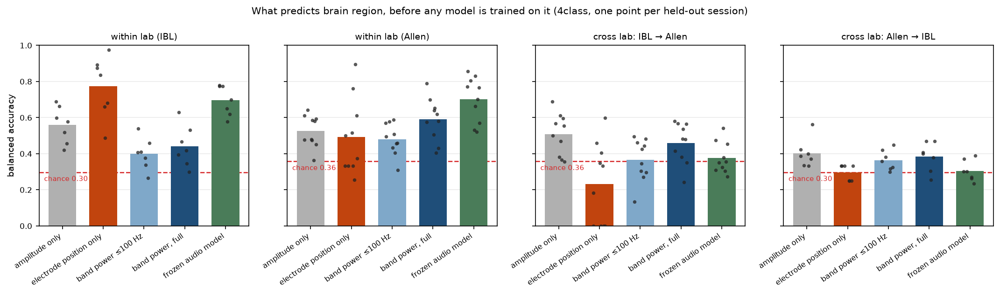

# lfp2vec-audit

[](https://github.com/happyc0der/lfp2vec-audit/actions/workflows/ci.yml)

**Are LFP2Vec-style anatomical predictions calibrated and interpretable under cross-lab shift, and how much of their accuracy is recoverable by trivial, interpretable baselines?**

> **Status: Stage 3 — fine-tune.** The reduced LFP2Vec method is trained and scored against every baseline on the same folds. Calibration and ablation analysis is still to come. Every claim below that is not yet measured is marked *planned*.

## What LFP2Vec is

[LFP2Vec](https://papers.nips.cc/paper_files/paper/2025/hash/b408053531ce6fd66a96bc3a86527bb9-Abstract-Conference.html) (He, Patel, Li, Maslarova, Vöröslakos, Ramanathan, Hung, Buzsáki & Varol, NeurIPS 2025) adapts the audio model `facebook/wav2vec2-base` to raw local field potential, continues self-supervised training on unlabelled LFP, and fine-tunes it to predict which brain region an electrode sits in from a 3-second single-channel recording. The paper reports zero-shot transfer across labs and probe geometries. Upstream code: [`tianxiao18/lfp2vec`](https://github.com/tianxiao18/lfp2vec).

## Why this repository exists

The LFP2Vec paper's own Broader Impact section states that clinical deployment "should include calibrated uncertainty estimates" — but no calibration metric is reported anywhere in the paper or supplement. Separately, [LFP-LOC](https://pmc.ncbi.nlm.nih.gov/articles/PMC13199280/) (Perna et al., *Frontiers in Neuroscience*, 2026) criticises LFP2Vec as lacking interpretability and requiring training, and proposes training-free band-power features instead — but offers no head-to-head comparison on shared data.

This repository measures both gaps on public data:

1. **Calibration under shift.** Does confidence stay meaningful when the test recording comes from a different lab?
2. **The interpretable-baseline floor.** How much of the accuracy is recoverable from six numbers per chunk (δ θ α β γ ripple relative power), from electrode depth alone, or from a frozen audio encoder with no LFP training at all?
3. **What the model listens to.** Which frequency bands actually drive predictions, and is that answer stable across seeds and sessions?

## What this repository does *not* claim

- It is **not** a full reproduction. The self-supervised continuation stage is out of scope on laptop-class compute; experiments start from the audio checkpoint and fine-tune. See [`docs/DEVIATIONS.md`](docs/DEVIATIONS.md).
- It does **not** evaluate on the Neuronexus mouse or macaque datasets, which are private to the original authors.
- A difference measured here is a difference **against this reproduction**, not a refutation of the published model. No pretrained LFP2Vec weights have been released, so exact published numbers cannot be checked.
- It does not claim LFP-based anatomical localisation is solved, unsolved, or anything in between.

## What is in the data so far

| store | chunks | channels | sources |
|---|---:|---:|---|
| IBL | 132,600 | 1,326 | 7 insertions, 5 labs |
| Allen | 50,200 | 502 | 10 probes, 2 sessions |

Full per-probe breakdown in [`docs/DATA_CARD.md`](docs/DATA_CARD.md); sampled chunks and
per-region spectra in [`docs/figures/`](docs/figures).

Two things worth knowing before any model is trained.

**The IBL recordings contain no CA2 channels at all.** Every CA2 chunk in the corpus comes from
Allen, and only four channels there. Any model trained on IBL therefore cannot predict CA2, and
scores zero recall on it by construction rather than by failure.

**The two datasets are filtered differently, and it is measurable.** Their mean spectra agree
below 100 Hz and diverge by up to 768-fold above 300 Hz, because the IBL pipeline band-passes at
0.5–300 Hz and the Allen cache does not. Relative power in the ripple band, the clearest
hippocampal marker, is 2.8 times higher in Allen. A classifier could separate the two labs on
that alone, without learning any anatomy. This is documented rather than corrected, and from
Stage 2 onward every cross-lab result is reported both on the full band and on a common band
below the IBL corner. See [`docs/DEVIATIONS.md`](docs/DEVIATIONS.md), D11.

## Baseline results

Leave-one-session-out across 17 folds, four-class view, logistic regression, mean balanced
accuracy. Every configuration carries a permutation control fitted on the same fold, and all of
them sit at their fold's chance level. Full tables in
[`docs/RESULTS_BASELINES.md`](docs/RESULTS_BASELINES.md).

| features | within IBL | within Allen | IBL → Allen | Allen → IBL |
|---|---:|---:|---:|---:|
| *chance* | *0.298* | *0.358* | *0.358* | *0.298* |
| amplitude only | 0.560 | 0.526 | 0.509 | 0.401 |
| **electrode position only** | **0.817** | **0.822** | **0.628** | **0.521** |
| band power, ≤100 Hz | 0.399 | 0.480 | 0.366 | 0.364 |
| band power, full | 0.441 | 0.590 | 0.460 | 0.384 |
| frozen audio model | 0.697 | 0.701 | 0.377 | 0.304 |



**Electrode position beats the neural signal.** Four numbers describing where a contact sits,
with the voltage discarded entirely, reach 0.82 where six band powers reach 0.44. Probes are
lowered along stereotyped trajectories and structures come in a predictable order along a shank,
so much of what "decoding region from LFP" measures here is available without the LFP. This is
the control the original paper does not report.

**The frozen audio model is the best signal-based feature within lab, and does not transfer.**
`facebook/wav2vec2-base`, run forward with nothing fine-tuned, reaches 0.70 and beats band power
on every IBL fold (Wilcoxon, 7/7, p = 0.016). So the audio prior does carry region information a
spectral summary does not. Across labs it scores 0.377 against a chance of 0.358.

**Why it collapses, and the calibration failure that comes with it.** A linear model identifies
which dataset a chunk came from with perfect accuracy from those same embeddings, on probes it
never saw:

| features | lab identification, area under curve |
|---|---:|
| band power, ≤100 Hz | 0.729 |
| band power, full | 0.837 |
| frozen audio embeddings | **1.000** |

The representation that makes the audio model the best within-lab feature is dominated by which
rig produced the recording. Meanwhile its expected calibration error rises from 0.124 within lab
to **0.478 and 0.631** across labs. A model at chance accuracy reporting high confidence is worse
than one that is merely wrong, and this is the failure the paper's own Broader Impact section
anticipates without measuring.

## The fine-tune

`facebook/wav2vec2-base` fine-tuned on IBL, 23,900 class-balanced chunks, nine epochs, scored on
all ten Allen probes. Full tables in [`docs/RESULTS_FINETUNE.md`](docs/RESULTS_FINETUNE.md).

| measure | value | reference |
|---|---:|---|
| within-lab validation* | **0.801** | electrode position alone reaches 0.817 |
| cross-lab, mean of 10 probes | **0.340** | chance on those probes is 0.358 |
| calibration error, cross-lab | **0.556** | the frozen checkpoint scored 0.478 |
| negative log-likelihood, cross-lab | **4.76** | a uniform predictor scores 1.39 |
| lab identity after fine-tuning | **0.997** | before fine-tuning it was 1.000 |

\* That within-lab figure is a **validation** score on a group that was also used for early
stopping, so it is optimistic and not directly comparable with the 0.817 position achieves on
clean test folds. The honest within-lab comparison needs the leave-one-session-out scheme and is
still running. The correct present statement is that the fine-tune reaches roughly 0.80 on a group
it was allowed to stop on, which is at best level with position.

**Across labs it is at chance, and confident.**

Not one of the ten target probes exceeded its own chance level. Presented with the other lab's recordings the model predicts visual cortex for
**93.9%** of chunks at **0.98** mean confidence, where the true share is 45%. That is not
degradation; it is a decision boundary fitted in one region of representation space being handed
inputs that all fall in another.

**The reason is measured, not inferred.** Nine epochs of supervised training on region labels
moved the lab-identity score from 1.000 to 0.997. Whatever encodes which rig produced a recording
survives fine-tuning intact, and while it does, a boundary learned in one lab cannot mean anything
in the other.

Cross-lab, the fine-tune scores below every baseline in the table above, including the same
checkpoint with nothing trained at all.

**What this does not show.** This is the reduced method: audio initialisation plus supervised
fine-tuning, without the self-supervised continuation on unlabelled LFP that the published work
runs (see [`docs/DEVIATIONS.md`](docs/DEVIATIONS.md), D1). That stage is the most plausible
candidate for removing acquisition structure, precisely because it trains on pooled unlabelled
data rather than on one lab's labels, and nothing here tests it. No pretrained weights have been
released, so the published numbers cannot be checked directly. These are results for what can be
reproduced on public data with laptop-class compute, with every control on the same folds.

## Planned experiments

| Stage | Experiment | Status |
|---|---|---|
| 1 | IBL and Allen data layer, group-aware splits, leakage verifier | **done** |
| 2 | Baselines: constant, depth-only, band-power, frozen wav2vec2 | **done** |
| 3 | LFP2Vec-lite fine-tune, cross-session and cross-lab | **in progress** |
| 4 | Temperature scaling, band-stop and phase-randomisation ablations, band attribution | planned |
| 5 | Selective prediction: risk–coverage under shift | planned |
| 6 | Two-page note and figures | planned |

## Reproducing what exists today

```bash
make setup    # uv venv + editable install
make test     # full unit suite, synthetic data only, no network
make smoke    # end-to-end pipeline run with planted ground truth
```

`make smoke` generates a synthetic dataset with known spectral signatures per region, builds a group-aware split, verifies it for leakage, fits a band-power classifier, and asserts two gates: the classifier beats chance, and the same classifier trained on permuted labels does not. Every real experiment must pass this first.

Building the real datasets, which does touch the network:

```bash
make data-ibl      # seven insertions, ~2.3 GB fetched
make data-allen    # two sessions, read over HTTP ranges
make splits        # write and verify every split
make real-smoke    # the same gates, on real data
```

## Data

| Source | Access | Labels | Fetched |
|---|---|---|---|
| [IBL](https://docs.internationalbrainlab.org/) Neuropixels | byte prefix of the compressed LF band, via ONE-api | CCF acronym per channel, from histological alignment | ~330 MB per insertion, of 2.4–3.8 GB files |
| [Allen Visual Coding](https://allensdk.readthedocs.io/en/latest/visual_coding_neuropixels.html) Neuropixels | HTTP range reads of the public NWB files | `location` column of the electrode table | ~140 MB per probe, of 1.3–2.5 GB files |

Both are cut to the same 3-second, 1250 Hz chunks and stored as one normalised float16 array plus a parquet index. The mean and scale removed by normalisation are recorded per chunk, so the original microvolt waveform is recoverable.

Neither dataset is fetched whole. The IBL recordings are compressed in one-second chunks stored in order, so the 500-second window the analysis uses is a byte prefix of the file; a truncated header describing only those chunks makes that prefix a valid standalone recording. The Allen files are read with range requests, one time slab across all channels at a time, which matches how their chunks are laid out on disk.

Raw data is never committed. Only run manifests, metrics, dataset cards and inspection figures live in the repository.

## Repository layout

```
lfpaudit/data/      fetch, label, chunk, index, split
lfpaudit/features/  band power, geometry
lfpaudit/models/    baselines and the wav2vec2 reproduction
lfpaudit/eval/      metrics, calibration, ablations, attribution, selective prediction
experiments/        one YAML per run
results/            manifests and metrics, committed
docs/               lab notebook, deviations, development notes
```

## Development notes

Much of this code was written with Claude Code. See [`docs/DEVELOPMENT_NOTES.md`](docs/DEVELOPMENT_NOTES.md) for what that means in practice and which parts were verified by hand. The running log of commands, decisions and dead ends is in [`docs/LAB_NOTEBOOK.md`](docs/LAB_NOTEBOOK.md).

## References

1. He, T., Patel, S., Li, S., Maslarova, A., Vöröslakos, M., Ramanathan, D., Hung, C., Buzsáki, G., & Varol, E. (2025). Self-supervised learning for in vivo localization of microelectrode arrays using raw local field potential. *NeurIPS 2025*.
2. Perna, G., Adamo, S., Vincenzi, M., Angotzi, G. N., Ribeiro, J. F., & Berdondini, L. (2026). LFP-LOC: an LFP power-based method for validating electrode localization. *Frontiers in Neuroscience*.
3. Baevski, A., Zhou, H., Mohamed, A., & Auli, M. (2020). wav2vec 2.0: a framework for self-supervised learning of speech representations. *NeurIPS 2020*.
4. International Brain Laboratory (2023). A brain-wide map of neural activity during complex behaviour. *bioRxiv*.
5. Siegle, J. H. et al. (2021). Survey of spiking in the mouse visual system reveals functional hierarchy. *Nature*.

## Licence

MIT. See [`LICENSE`](LICENSE).
