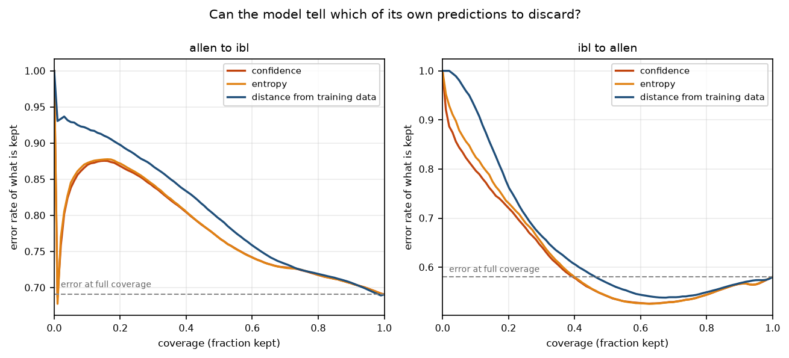
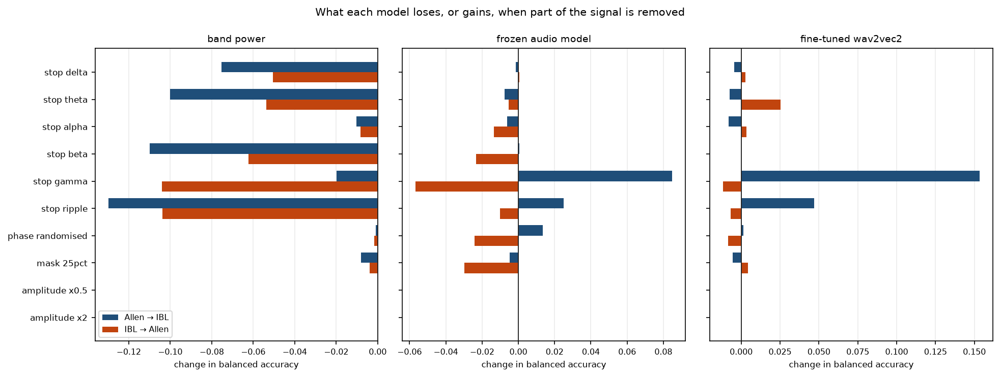

# Calibration, abstention and ablation

Generated by `lfpaudit stage4-report` from the tables under `results/`. Every figure
below is reproducible from those files alone.

All numbers are for the reduced method: audio initialisation plus supervised
fine-tuning, without the self-supervised stage the published work runs (see
`DEVIATIONS.md`, D1).

## Can the confidence be repaired?

One temperature fitted on in-lab validation logits by minimising negative
log-likelihood, then applied unchanged to the cross-lab test logits. The oracle row
is the temperature the target lab would have needed, which requires labelled target
data to find and so is not available to a zero-shot method.

| direction | split | temperature | ECE | NLL | mean confidence | accuracy |
|---|---|---:|---:|---:|---:|---:|
| Allen to IBL | in lab | 1.00 → 1.72 | 0.114 → 0.054 | 0.692 → 0.574 | 0.899 → 0.805 | 0.786 |
| Allen to IBL | cross lab | 1.00 → 1.72 | 0.656 → 0.580 | 4.672 → 2.815 | 0.965 → 0.889 | 0.309 |
| Allen to IBL | cross lab, oracle | 1.00 → 11.79 | 0.656 → 0.002 | 4.672 → 1.572 | 0.965 → 0.308 | 0.309 |
| IBL to Allen | in lab | 1.00 → 1.84 | 0.100 → 0.025 | 0.610 → 0.475 | 0.923 → 0.838 | 0.825 |
| IBL to Allen | cross lab | 1.00 → 1.84 | 0.560 → 0.510 | 4.786 → 2.670 | 0.980 → 0.929 | 0.420 |
| IBL to Allen | cross lab, oracle | 1.00 → 8.26 | 0.560 → 0.041 | 4.786 → 1.499 | 0.980 → 0.399 | 0.420 |

In both directions the in-lab fit works and the same scalar barely moves the
cross-lab number. Allen to IBL needed 11.79 against an in-lab fit of 1.72, a factor of 6.8; IBL to Allen needed 8.26 against an in-lab fit of 1.84, a factor of 4.5.

The remedy the paper's Broader Impact section calls for therefore exists, is a single
number, and cannot be found without exactly the labelled target data that zero-shot
transfer claims not to need.

## Can the model tell when not to trust itself?

Three scores per test chunk. The first two come from the model's output, the third
from the distance of its own representation to the training distribution.

`AURC` is the area under the risk-coverage curve: **lower is better, and any value
above the error at full coverage means discarding uncertain predictions leaves a
worse set than keeping everything**. `separation` is how well the score tells in-lab
from cross-lab inputs, where 0.5 is no information.

| direction | score | AURC | error, all kept | error, best fifth | separation |
|---|---|---:|---:|---:|---:|
| Allen to IBL | max_softmax | 0.779 | 0.691 | 0.868 | 0.400 |
| Allen to IBL | entropy | 0.780 | 0.691 | 0.872 | 0.398 |
| Allen to IBL | mahalanobis | 0.805 | 0.691 | 0.898 | 0.495 |
| IBL to Allen | max_softmax | 0.618 | 0.580 | 0.721 | 0.315 |
| IBL to Allen | entropy | 0.625 | 0.580 | 0.732 | 0.327 |
| IBL to Allen | mahalanobis | 0.651 | 0.580 | 0.764 | 0.955 |

Every area sits above the error at full coverage, in both directions and for every
score, so abstention does not help.

Confidence and entropy separate in-lab from cross-lab at below 0.5, which means the
model is **more** confident on recordings from a lab it has never seen than on
held-out data from its own.

Distance from the training distribution reaches 0.955 in one direction and 0.495 in
the other, while a supervised probe separates the labs at 0.994 in both. The
structure is present either way; whether an unsupervised distance can reach it is
what changes. Mahalanobis distance measures displacement in units of covariance, so a
large shift that happens to lie along a direction the reference cloud is already wide
in is cheap by that metric. A supervised probe picks its own direction; a distance
cannot. A distance-based gate is therefore not a dependable safeguard here.

## What does each model listen to?

Each transform is applied to test inputs only; no model is retrained. Values are the
change in balanced accuracy from the unmodified reference, so negative means the
transform cost the model accuracy.

### Allen to IBL

| transform | bandpower | frozen | finetuned |
|---|---|---|---|
| unmodified | 0.361 | 0.256 | 0.256 |
| stop delta | -0.075 | -0.001 | -0.004 |
| stop theta | -0.100 | -0.008 | -0.007 |
| stop alpha | -0.010 | -0.006 | -0.008 |
| stop beta | -0.110 | +0.001 | -0.000 |
| stop gamma | -0.020 | +0.085 | +0.153 |
| stop ripple | -0.130 | +0.025 | +0.047 |
| phase randomised | -0.001 | +0.013 | +0.001 |
| mask 25pct | -0.008 | -0.005 | -0.005 |
| amplitude x0.5 | +0.000 | +0.000 | +0.000 |
| amplitude x2 | +0.000 | +0.000 | +0.000 |

### IBL to Allen

| transform | bandpower | frozen | finetuned |
|---|---|---|---|
| unmodified | 0.304 | 0.229 | 0.193 |
| stop delta | -0.050 | +0.000 | +0.003 |
| stop theta | -0.054 | -0.005 | +0.025 |
| stop alpha | -0.008 | -0.014 | +0.003 |
| stop beta | -0.062 | -0.023 | +0.000 |
| stop gamma | -0.104 | -0.057 | -0.012 |
| stop ripple | -0.104 | -0.010 | -0.007 |
| phase randomised | -0.002 | -0.024 | -0.008 |
| mask 25pct | -0.004 | -0.030 | +0.004 |
| amplitude x0.5 | +0.000 | +0.000 | +0.000 |
| amplitude x2 | +0.000 | +0.000 | +0.000 |

**The controls pass exactly.** Amplitude scaling moves balanced accuracy by 0.000 in
every cell, as per-chunk normalisation requires. Had it moved, nothing else here
would be worth reading.

**Phase randomisation costs nothing.** Replacing each chunk with a surrogate that
keeps its power spectrum and destroys its waveform leaves all three models where they
were. Band power must be unaffected, since it is computed from the spectrum the
transform preserves, and it is; that is the invariant holding on real data. The two
neural models are unaffected too, so on this task the transformer is reading spectral
power and essentially nothing else. That is also why fine-tuning adds only 0.007 over
an untrained checkpoint: there is little else in the representation to sharpen.

**Removing the contaminated bands helps, in one direction only.** Training on Allen
and testing on IBL, deleting the gamma band raises the fine-tuned model from 0.256 to
0.409 against a chance of 0.250, taking above-chance performance from 0.006 to 0.159,
about two fifths of the within-lab margin, by discarding information. The same
deletion does nothing in the other direction.

That asymmetry follows from D11, recorded before any model was trained: Allen retains
energy above 300 Hz where the IBL pipeline filters it away, by up to a factor of 768.
A model trained on Allen learns content absent from IBL and is misled when it is
missing; a model trained on IBL never had the chance to learn it. Band power loses
accuracy from every deletion, because each of its features carries signal and none is
a learned shortcut.

